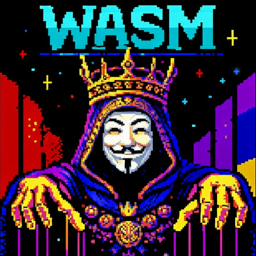

<a href="https://lnbits.com" target="_blank" rel="noopener noreferrer">
  <picture>
    <source media="(prefers-color-scheme: dark)" srcset="https://i.imgur.com/QE6SIrs.png">
    
  </picture>
</a>

# WASM Host — _LNbits extension_

**A safer, permissioned runtime for WASM extensions.**
Run vibe-coded or unvetted extensions without bloating core LNbits.

---

## Features

- Per-extension KV and secret storage
- Public handlers and public KV reads
- Payment watchers (by tag) and scheduled tasks
- Authenticated handler calls for backend APIs
- Explicit permission model for internal API access

## Usage

1. Enable the `wasm` extension in the LNbits UI.
2. Install a WASM extension under `lnbits/extensions/<ext_id>/`.
3. Drop your module in `lnbits/extensions/<ext_id>/wasm/module.wasm` (or `.wat`).
4. Define permissions and public handlers in `config.json`.

## Settings

The host settings are available at `/wasm` for admins:

- `Timeout (seconds)`
- `Max module bytes`
- `Max DB ops per minute`
- `Max KV bytes per extension`
